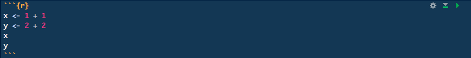

```{r setup, include=FALSE}
knitr::opts_chunk$set(echo = TRUE)
```

###Text

###Bullets and numbering

###Code
Code can be displayed and executed in R markdown. On one hand it can be written inline, and on the other hand it can be written into code chunks. In code chunks there's a variety of display options available that we'll also include in the examples below.

 

This picture shows what a typical code chunk looks like in the editor. Below the first example we'll look at the different parameters available, without showing the code for the codechunks specificly.

```{r}
x <- 1 + 1  
y <- 2 + 2
x
y
```  

Above is a typical code chunk without any particular options. As you can see, it shows the code and displays the result. Notice how the variables appear in seperate boxes when called. This is because R markdown executes one action at a time.  

It is possible to make the chunk run the commands first and then display the results at the same time. Sometimes that looks much better than having a striped document. To do that you define the chunk as follows:

> {r, results = 'hold'}
>```{r}
>#Tells R to hold the results untill the end of the code chunk.
>```

Sometimes you'd like to show the result, but not the code. In order to do that you can use the **echo** parameter. By declaring **echo** to be false you are telling R markdown to not display the code, but only the result.

> {r, echo = FALSE}
>```{r}
>##Tells R not to show the code chunk.
>```

Other variations on the **echo** parameter include:

> {r, echo = 2:3}
>```{r}
>##Telling R to only display lines 2 and 3 of the code.
>```

> {r, echo = -3}
>```{r}
>##Telling R to show all code, except line 3.
>```


Sometimes you don't even want the output to be seen either:

> {r, warning = FALSE, error = FALSE, include = FALSE}
>```{r}
>##Shows neither code chunk nor results.
>```

In this particular parameter example the **warning** parameter defines whether or not possible warnings will be displayed in the document or in the console. By setting the **error** parameter to FALSE we make sure that R stops in case of an error, else it won't. By setting the **include** parameter to FALSE, we finally declare that we don't want the chunk or the output to be seen. - Clearly, the **include** parameter would generally suffice, but this parameter combination is quite generally used.


More info on chunk parameters can be found [HERE](http://yihui.name/knitr/options/)

----
[LICENSE: CC-BY-SA-4.0](LICENSE)